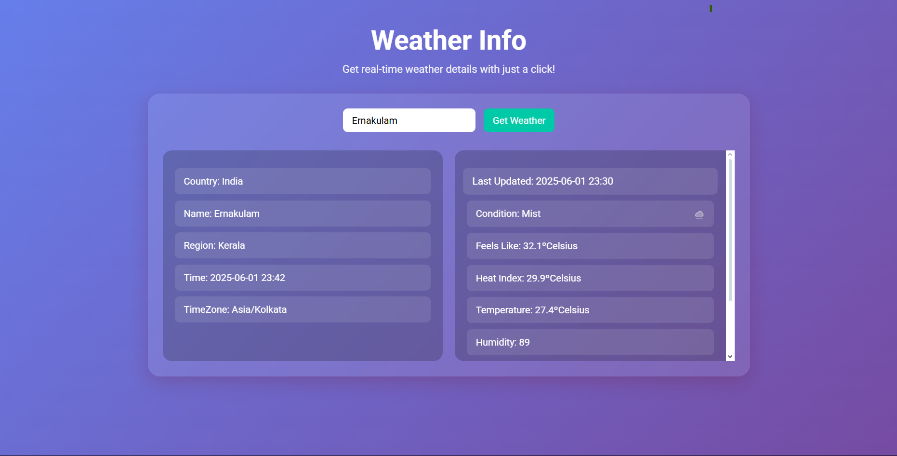
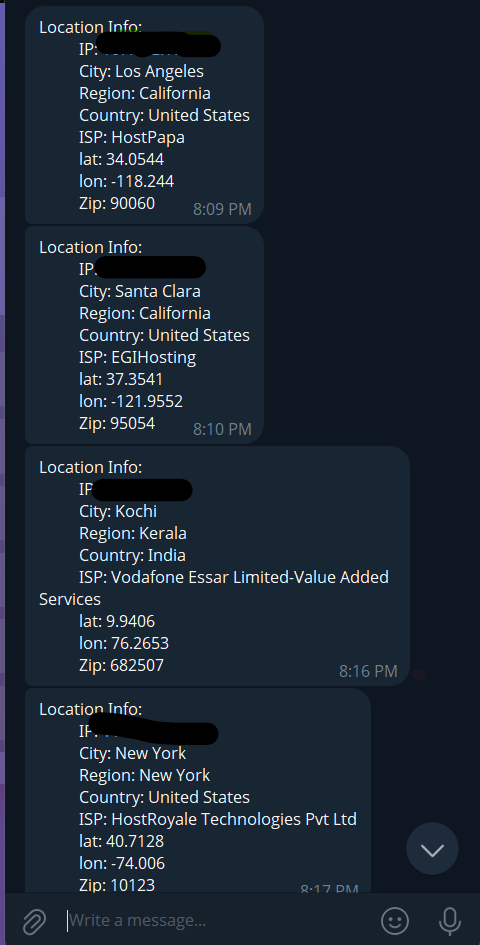

# 🌦️ Real-Time Weather Web App (Made for Fun with AngularJS)

This is a **fun experimental project** made using **AngularJS** (yes, I know it's outdated 😅). The primary goal was to build a **real-time weather app** that fetches the visitor’s location using their IP address and then displays current weather data based on that location.

## 🧩 What It Does:
- Gets **real-time weather data** (temperature, humidity, etc.) using a free weather API.
- (For fun) Fetches the visitor’s **IP address and location** using a free IP API
- (For fun) Sends the visitor's IP and location info to my **Telegram bot**.

## 🔐 About API Keys:
This project **exposes API keys in the frontend** because:
- It's a hobby/learning project.
- I'm using **free-tier public APIs**, so I don't mind.
- Not meant for production use.

## 🎯 Why AngularJS?
Honestly? Just for the nostalgia and fun. I know it's outdated and not suitable for serious work anymore. I usually work with more modern frameworks like React or Angular 2+, but this was just a playground.

## ⚠️ Disclaimer:
- **Don’t use this design in production.**
- API keys should never be exposed client-side in real apps.
- This is for **learning, curiosity, and fun** only.

## 🧪 Tech Stack:
- **AngularJS**
- **Telegram Bot API**
- **ip-api.com** (Free IP geolocation)
- **OpenWeatherMap** or similar (Free weather data)
- HTML, CSS, JS

## 🖼️ Screenshots:
| Homepage |Ip Details |
|----------|-----------------|
|  |  |

## 🧠 Ideas for Improvement:
- Use a backend to hide API keys.
- Switch to React or Vue.
- Add charts or animations for weather trends.
